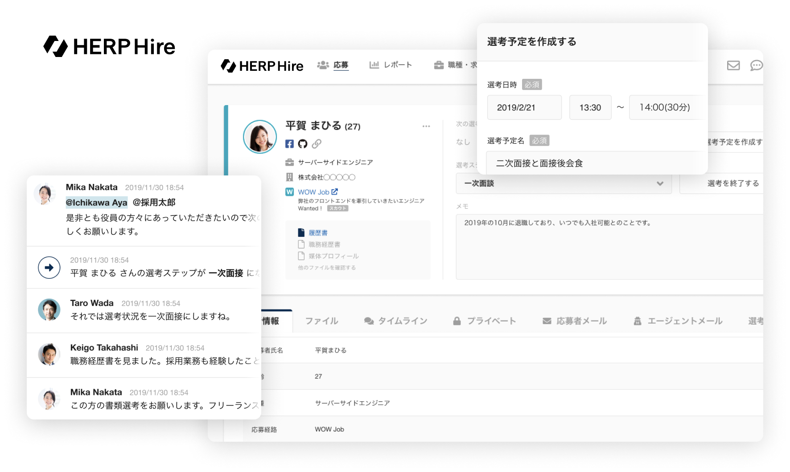

# HERP について

- [会社概要](#会社概要)
- [ミッション](#ミッション)
- [サービス](#サービス)
  - [HERP Hire](#herp-hire)
  - [HERP Nurture](#herp-nurture)
- [チーム](#チーム)
  - [development team](#development-team)
  - [revenue team](#revenue-team)
  - [corporate team](#corporate-team)
- [福利厚生](#福利厚生)
- [アクセス](#アクセス)
  - [東京本社](#東京本社)
  - [筑波オフィス](#筑波オフィス)
  - [京都オフィス](#京都オフィス)

---

## 会社概要

| key            | value                                                 |
| -------------- | ----------------------------------------------------- |
| 社名           | `株式会社HERP` (`HERP, Inc.`)                         |
| 本社所在地     | 〒 141-0031 東京都品川区西五反田 7-22-17 TOC ビル 12F |
| 設立           | 2017 年 3 月                                          |
| 代表取締役 CEO | 庄田 一郎                                             |
| 資本金         | 100,000,000 円                                        |
| 従業員数       | 40 名 (インターン含む)                                |

## ミッション

**「日本の採用 2.0 を実現する」**

- **採用変革を通じて日本企業を進化させる**
  - 大企業を含む日本の採用における意思決定を現場起点にする (意思決定を民主化し、精度の高いものにする)
  - 上記を通じて、人の力を最大限引き出せる新しい日本型企業を多く生み出す
- **日本の人材サービス市場を健全化する**
  - HR 事業者・企業・候補者の情報量の差分を埋める
  - 営業ではなくサービス品質で勝てることを証明することで、業界全体のサービス品質を向上させる

## サービス

### [HERP Hire](https://herp.cloud/)

**スクラム採用を支える採用プラットフォーム**

求人媒体からの応募情報の自動連携、Slack/Chatwork 連携による現場メンバーへのスピーディな情報共有により、現場メンバーが積極的に採用に参画できる「スクラム採用」の実現をサポートします。



### [HERP Nurture](https://lp.herp.cloud/nurture/)

**スクラム採用時代のタレント管理プラットフォーム**

タレント（潜在的な候補人材）の選考意欲およびアプローチを可視化し、最適なコミュニケーションを実現するスクラム採用向けタレント管理プラットフォームです。


## チーム

人数は 2021 年 4 月現在・正社員のみ

### development team

18 名

- SRE (2 名)
- UI/UX デザイナー (3 名)
- スクラムマスタ (1 名)
- ソフトウェアエンジニア (11 名)
- プロダクトマネージャー (1 名)

### revenue team

15 名

- マーケティング
- インサイドセールス
- フィールドセールス
- カスタマーサクセス

### corporate team

2 名

- 経理
- 労務
- 法務
- 総務
- ファイナンス

## 福利厚生

- 社用端末支給
- ディスプレイ支給
- 書籍購入制度
- フリードリンク (水・スペシャルティコーヒー)

## アクセス

### 東京本社

[Google マップで開く](https://goo.gl/maps/i1DsCNXs5SqUsTKP9)

```
〒141-0031
東京都品川区西五反田7-22-17 TOCビル12F
```

- JR・都営地下鉄五反田駅より徒歩 8 分
- 東急電鉄目黒線不動前駅より徒歩 6 分
- 東急電鉄池上線大崎広小路駅より徒歩 5 分

### 筑波オフィス

[Google マップで開く](https://goo.gl/maps/hApp7Eua8PZXVyYm9)

```
〒305-0005
茨城県つくば市天久保2-14-2 つくばイーストビル201
```

- つくばエクスプレスつくば駅より徒歩 25 分

### 京都オフィス

[Google マップで開く](https://goo.gl/maps/g3uqEnYyxRAhQPL98)

```
〒606-8396
京都府京都市左京区川端通丸太町下る下堤町82-1 恵美須ビル4階西
```

- 京阪電鉄鴨東線神宮丸太町駅より徒歩 1 分
