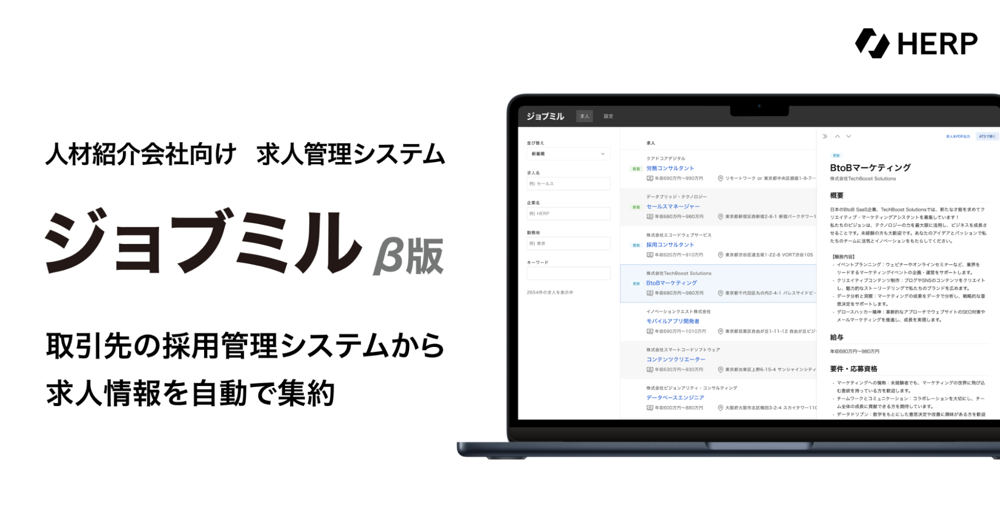

# HERPについて

- [会社概要](#会社概要)
- [ミッション](#ミッション)
- [ビジョン](#ビジョン)
- [事業・プロダクト](#事業・プロダクト)
  - [採用管理事業](#採用管理事業)
    - [HERP Hire](#herp-hire)
    - [HERP Nurture](#herp-nurture)
  - [エージェント向け事業](#エージェント向け事業)
    - [ジョブミル](#ジョブミル)
- [組織構成](#組織構成)
- [メンバー構成](#メンバー構成)
- [福利厚生](#福利厚生)
- [アクセス](#アクセス)

---

## 会社概要

| key           | value                                                                 |
| ------------- | --------------------------------------------------------------------- |
| 社名          | 株式会社HERP (HERP, Inc.)                                             |
| 本社所在地    | 〒141-0031 東京都品川区西五反田8丁目8番15号 カーニープレイス五反田8階 |
| 設立          | 2017年3月                                                             |
| 代表取締役CEO | 庄田 一郎                                                             |
| 資本金        | 796,666千円（資本準備金含む）                                         |
| 従業員数      | 54名（正社員）                                                        |

## ミッション

「**企業は人で決まる。人は経験で決まる。**」という信念のもと、「**採用を変え、日本を強く。**」という HERP が果たしていくミッションを掲げています。

**採用を変え、日本を強く。**

```
日本から世界に誇れる企業が多く生まれることで、日本はもう一度強くなれる。
それを信じて、我々は新しい採用の形を提案し続けます。

世界に誇れる企業を生み出すのは、他でもなくその企業で働く人々であると我々は考えています。
企業が大きな志を成し遂げるために最も重要なのはそこで働く人々であることを、これまで多くの企業と人との出会いを支援してきた経験から知っているためです。
大きな志を持った会社に、共感と覚悟を持った人が集まることが、日本を強くする一番の方法だと確信しています。

だからこそHERPは、大きな志をもつ企業を支える伴走者として、企業と人の出会いをより良くするために努力を続けていきます。
企業と人のより良い出会いが日本を強くすると信じて。
```

**企業と人材の本当に良いマッチング**は、その求人の目的や課題解決を果たすだけではありません。企業と人材の成長をもたらすことで、それぞれの**その次の大きな挑戦**につながるものであると考えています。
HERPは、採用におけるこの好循環を回し続けることで、日本企業や日本の人材を強くしたいと考えています。

## ビジョン

ミッションを果たすため、「**すべての採用における意思決定を、その次の挑戦を生み出すものに**」をビジョンとして実現していきます。

- **企業と人材の本当に良いマッチング**は、その求人の目的や課題解決を果たすだけではありません。企業と人材の成長をもたらすことで、それぞれの**その次の大きな挑戦**につながるものであると考えています。
- HERPは、採用におけるこの好循環を回し続けることで、日本企業や日本の人材を強くしたいと考えています。

## 事業・プロダクト

### 採用管理事業

#### [HERP Hire](https://lp.herp.cloud/)

**デジタル人材採用を加速する採用管理システム**

業務の『効率化』だけでなく、『採用成果の向上』を実現する採用管理システムです。デジタル人材採用に必要な、現場巻き込み型の「スクラム採用」のための機能を備えています。


#### [HERP Nurture](https://lp.herp.cloud/nurture/)

**デジタル人材採用を加速するタレントプールシステム**

タレント（潜在的な候補人材）の選考意欲およびアプローチを可視化し、最適なコミュニケーションを実現するスクラム採用向けタレント管理プラットフォームです。


### エージェント向け事業

#### [ジョブミル](https://www.jobmiru.cloud/)

**人材紹介会社向け 求人管理システム**

ジョブミルは、取引先の採用企業のバラバラの採用管理システムから求人情報を自動で集約し、取引先の全求人から一括検索を可能にします。



## 組織構成

HERPでは、全社における活動を3つの事業活動と8つの機能活動に区分して経営しています。

- 事業活動: ミッションの遂行・ビジョンの実現に必要となる個別の事業
- 機能活動: HERPがミッションを遂行し続けるために必要な、経営上重要となる経営機能

各メンバーが「主活動」を一つ持ちながら、ニーズや意欲があれば他の活動にも積極的に参加しています。

### 事業活動

| 活動名称             | 活動目的・内容                                                                              |
| -------------------- | ------------------------------------------------------------------------------------------- |
| 採用管理事業         | 採用管理システムのHERP Hireを中心とした、企業の採用管理業務の強化を通じた採用成功を支援する |
| エージェント向け事業 | 人材紹介会社経由のマッチングの質の向上につながる事業を運営する                              |
| R&D                  | ミッションを遂行するための新規事業や新サービスのシーズを発見し検証する                      |

### 機能活動

| 活動名称             | 活動目的・内容                                                                       |
| -------------------- | ------------------------------------------------------------------------------------ |
| エンジニアリング機能 | ソフトウェアエンジニアリングの生産性・スループットを事業・プロダクト横断で高める     |
| データ機能           | 事業活動や機能活動を通じ蓄積されるデータ資産の活用推進を担う                         |
| セキュリティ機能     | 情報資産セキュリティの確保と、企業・事業のセキュリティ観点からの信頼向上を担う       |
| 経営企画機能         | 事業活動や機能活動を円滑に進めるための全社的な仕組み化や、知見の取りまとめを担う     |
| ブランド機能         | HERPのブランド資産の形成・維持・蓄積・活用を進める                                   |
| HR機能               | 人的資本の調達活動をファシリテートし、活用推進を行う                                 |
| ファイナンス機能     | 金銭的資本の調達活動を推進し、その活用方針を定める                                   |
| アドミン機能         | コーポレートガバナンス・コンプライアンスを担保し、メンバーの働きやすい環境を整備する |

## メンバー構成

取締役・正社員含めて約50名。取締役3名・開発職20名強・ビジネス職20名強・コーポレート職数名という構成で、平均年齢は31歳です。
各メンバーのプロフィールは下記をご参照ください。

https://careers.herp.co.jp/members

## 福利厚生

- 社用端末支給
- ディスプレイ支給
- 書籍購入制度
- フリードリンク (水・スペシャルティコーヒー)

## アクセス

[Google マップで開く](https://goo.gl/maps/GUCa6oxBNgYcmhjt6)

```
〒141-0031
東京都品川区西五反田8-8-15 カーニープレイス五反田8F
```

- JR・都営地下鉄五反田駅より徒歩10分
- 東急電鉄目黒線不動前駅より徒歩15分
- 東急電鉄池上線大崎広小路駅より徒歩4分
