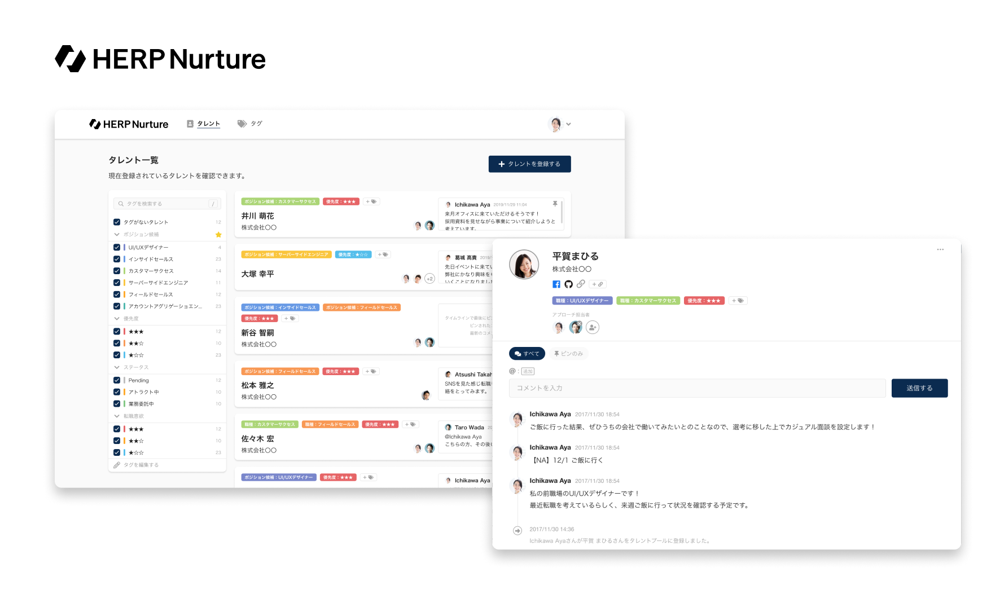

# HERP について

- [会社概要](#会社概要)
- [ミッション](#ミッション)
- [プロダクトビジョン](#プロダクトビジョン)
- [プロダクト](#プロダクト)
  - [HERP Hire](#herp-hire)
  - [HERP Nurture](#herp-nurture)
- [チーム](#チーム)
  - [development team](#development-team)
  - [revenue team](#revenue-team)
  - [corporate team](#corporate-team)
- [福利厚生](#福利厚生)
- [アクセス](#アクセス)
  - [東京本社](#東京本社)
  - [筑波オフィス](#筑波オフィス)
  - [京都オフィス](#京都オフィス)

---

## 会社概要

| key            | value                                                 |
| -------------- | ----------------------------------------------------- |
| 社名           | `株式会社HERP` (`HERP, Inc.`)                         |
| 本社所在地     | 〒 141-0031 東京都品川区西五反田 7-22-17 TOC ビル 12F |
| 設立           | 2017 年 3 月                                          |
| 代表取締役 CEO | 庄田 一郎                                             |
| 資本金         | 796,666,000 円                                        |
| 従業員数       | 63 名 (インターン含む)                                |

## ミッション

**採用を変え、日本を強く。**

```
日本から世界に誇れる企業が多く生まれることで、日本はもう一度強くなれる。
それを信じて、我々は新しい採用の形を提案し続けます。

世界に誇れる企業を生み出すのは、他でもなくその企業で働く人々であると我々は考えています。
企業が大きな志を成し遂げるために最も重要なのはそこで働く人々であることを、これまで多くの企業と人との出会いを支援してきた経験から知っているためです。
大きな志を持った会社に、共感と覚悟を持った人が集まることが、日本を強くする一番の方法だと確信しています。

だからこそHERPは、大きな志をもつ企業を支える伴走者として、企業と人の出会いをより良くするために努力を続けていきます。
企業と人のより良い出会いが日本を強くすると信じて。
```

2021 年 10 月にミッションを改訂しました。
詳しい背景やメッセージについては、[HERP Culture Deck](https://culture.herp.co.jp/998edaef25f9484aa323b6bf3b63b7dc) や [代表の庄田の note](https://note.com/fabichirox/n/n69b934907b66) をご覧ください。

## プロダクトビジョン

**オープンな採用を支え、事業成長を加速させる。**

企業が選ばれる時代に求められるオープンな採用を支えることで、企業の採用を成功させ強い事業・強い企業をつくることをサポートします。

詳しくは [HERP Culture Deck](https://www.notion.so/herp/fcc88971ec924bb1b4ad77d36157bfcb) をご覧ください。

## プロダクト

### [HERP Hire](https://herp.cloud/)

**スクラム採用を支える採用プラットフォーム**

求人媒体からの応募情報の自動連携、Slack/Chatwork 連携による現場メンバーへのスピーディな情報共有により、現場メンバーが積極的に採用に参画できる「スクラム採用」の実現をサポートします。


### [HERP Nurture](https://lp.herp.cloud/nurture/)

**スクラム採用時代のタレント管理プラットフォーム**

タレント（潜在的な候補人材）の選考意欲およびアプローチを可視化し、最適なコミュニケーションを実現するスクラム採用向けタレント管理プラットフォームです。



## チーム

人数は 2022 年 6 月現在・正社員のみ

### development team

23 名

- SRE (3 名)
- プロダクトデザイナー (3 名)
- ソフトウェアエンジニア (14 名)
- プロダクトマネージャー (2 名)

### revenue team

22 名

- マーケティング
- インサイドセールス
- フィールドセールス
- カスタマーサクセス
- 事業開発

### corporate team

7 名

- 経理
- 労務
- 法務
- 総務
- ファイナンス
- 広報
- コーポレート IT

## 福利厚生

- 社用端末支給
- ディスプレイ支給
- 書籍購入制度
- フリードリンク (水・スペシャルティコーヒー)

## アクセス

### 東京本社

[Google マップで開く](https://goo.gl/maps/i1DsCNXs5SqUsTKP9)

```
〒141-0031
東京都品川区西五反田7-22-17 TOCビル12F
```

- JR・都営地下鉄五反田駅より徒歩 8 分
- 東急電鉄目黒線不動前駅より徒歩 6 分
- 東急電鉄池上線大崎広小路駅より徒歩 5 分

### 筑波オフィス

[Google マップで開く](https://goo.gl/maps/hApp7Eua8PZXVyYm9)

```
〒305-0005
茨城県つくば市天久保2-14-2 つくばイーストビル201
```

- つくばエクスプレスつくば駅より徒歩 25 分

### 京都オフィス

[Google マップで開く](https://goo.gl/maps/g3uqEnYyxRAhQPL98)

```
〒606-8396
京都府京都市左京区川端通丸太町下る下堤町82-1 恵美須ビル4階西
```

- 京阪電鉄鴨東線神宮丸太町駅より徒歩 1 分
