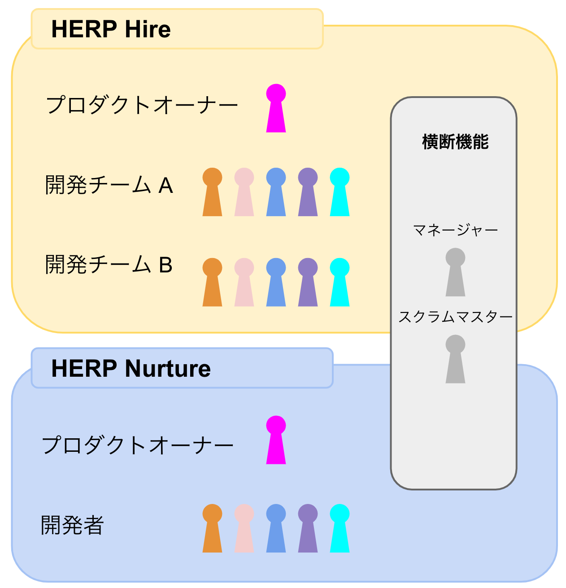

# 開発体制・組織

- [開発体制](#開発体制)
- [DevOps](#devops)

---

## 開発体制

### スクラム開発

HERP 開発チームでは全てのプロダクトで スクラム や Large-Scale Scrum(以下 LeSS)というフレームワークを用いて開発をしています。
なぜ スクラム やその関連のフレームワークを使っているのでしょうか。

HERP のミッション達成のために HERP が掲げるバリューを大事にしたいと考えています。
そして、スクラムの考え方は HERP のバリューを大事にできると考えています。

HERP のバリューのトップレベルには`自律` `ユーザー価値起点` `組織指向`の三つが掲げられています。これらに紐づくスクラムの考え方である[アジャイル宣言の背後にある原則](https://agilemanifesto.org/iso/ja/principles.html)を一部抜粋します。

- `ユーザー価値起点`

  > 顧客満足を最優先し、価値のあるソフトウェアを早く継続的に提供します。

- `自律`

  > 意欲に満ちた人々を集めてプロジェクトを構成します。環境と支援を与え仕事が無事終わるまで彼らを信頼します。

- `組織指向`
  > ビジネス側の人と開発者は、プロジェクトを通して日々一緒に働かなければなりません。

### 組織的な体制

HERP の開発チームでは LeSS の原理原則であるプロダクト全体思考に則って、プロダクト全体を責務に組織を作っています。

HERP には主要なプロダクトが二つあります。

- [HERP Hire](https://herp.cloud/)
- [HERP Nurture](https://lp.herp.cloud/nurture/)

HERP Hire の開発は LeSS、HERP Nuture の開発には スクラム を用いています。

チームはプロダクト全体を責務にしているため、クロスファンクショナルなチームとなっており、ユーザーヒアリングから企画、デザイン、開発、運用などのソフトウェア価値提供に関する全てのスキルをチームとして保有しています。
スクラム と LeSS の使い分けですが、一つのプロダクトに対して二つ以上の開発チームが存在する場合に LeSS を使っています。

そしてプロダクト毎に一人プロダクトオーナーと呼ばれるプロダクトの方向性を決める責任者がアサインされています。

チーム単位では毎日昼の 12 時からの朝会と隔週でふりかえりミーティング、組織全体では各チームから毎回異なる代表者一人から二人を選出して隔週でふりかえりミーティングを行い、プロセスや働き方、ツール、その他様々な面でこまめに改善を行っています。

## DevOps

各サービスには 1 名から数名のサービスオーナーがおり、コード品質の担保・リリースの作成およびデプロイ・SLI/SLO の策定・アラートへの対応などの責務を持ちます。

HERP で開発されたほぼすべてのアプリケーションは、[Amazon EKS](https://aws.amazon.com/eks/) 上の [Kubernetes](https://kubernetes.io/) クラスタ上にデプロイされます。
そのため、各リポジトリは [Docker](https://www.docker.com/) イメージを成果物として作成します。
各アプリケーションの構成は継続的デリバリのためのリポジトリで管理されており、[Argo CD](https://argoproj.github.io/argo-cd/) によってデプロイされています。
